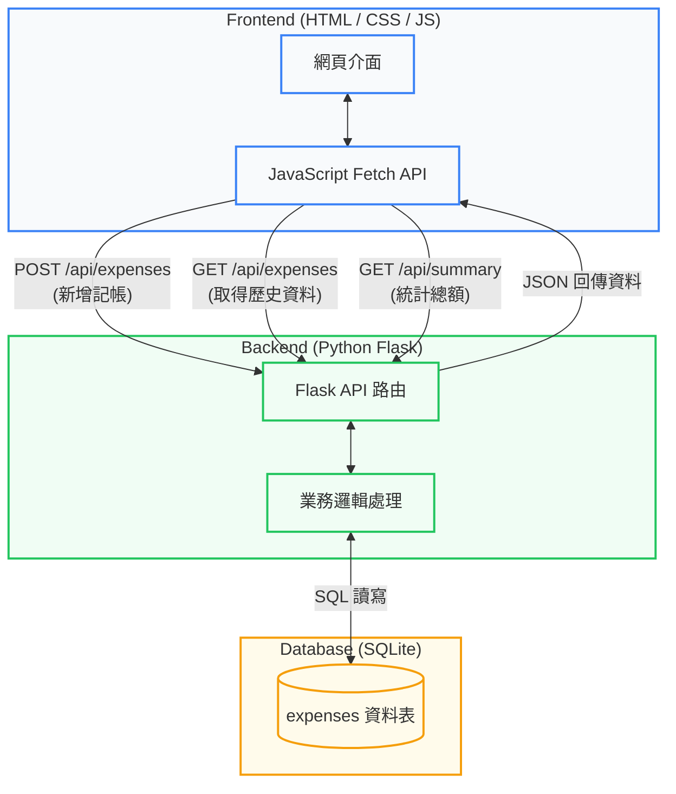

# 期末專題主題報告

**繳交時間：** 5/7
**對應 SDLC 階段：** 規劃（Planning）× 需求分析（Requirements Analysis）
**報告時間：** 5/7 上課時一組一組看

## 基本資訊
| 項目 | 內容 |
| :--- | :--- |
| **專題名稱** | 簡易個人記帳系統 (Simple Expense Tracker) |
| **組別 / 組號** | 第 ___ 組 |
| **組員姓名** | 1. _______ 2. _______ 3. _______ |

---

## 一、專題概述（Planning）

### 1.1 動機與背景
大學生常有生活費不知去向、月底吃土的困擾。市面上的記帳 App 功能往往過於複雜（如：各種廣告、複雜的圖表、投資理財功能），導致使用者難以養成每天記帳的習慣。因此，我們希望能開發一個「介面極度簡潔、只要幾秒鐘就能完成記帳」的輕量化網頁工具。

### 1.2 目標使用者
主要針對大學生，以及只需要簡單記錄日常開銷、不想要複雜功能的個人使用者。

### 1.3 專題目標
*   **目標一：** 提供直覺且快速的新增收支紀錄介面。
*   **目標二：** 能一目了然地查看近期的歷史收支明細。
*   **目標三：** 自動計算並顯示目前的總收入、總支出與結餘。

---

## 二、需求分析（Requirements Analysis）

### 2.1 功能性需求（Functional Requirements）
| 功能編號 | 功能名稱 | 功能描述 |
| :--- | :--- | :--- |
| **F-01** | 新增收支紀錄 | 使用者可輸入「金額」、「收/支類別」、「日期」與「備註」，並儲存至資料庫。 |
| **F-02** | 歷史紀錄列表 | 系統能列出所有的歷史記帳紀錄，並由新到舊依日期排序顯示在畫面上。 |
| **F-03** | 統計結餘總額 | 系統能自動計算所有紀錄，並在畫面上方顯示「總收入」、「總支出」與「目前結餘」。 |

### 2.2 非功能性需求（Non-functional Requirements）
| 類別 | 需求描述 |
| :--- | :--- |
| **效能** | 頁面載入時間與新增紀錄的反應時間需小於 2 秒，確保操作順暢。 |
| **安全性** | 避免基本的 SQL Injection 攻擊（透過 SQLAlchemy 或參數化查詢實作）。 |
| **易用性** | 前端介面需乾淨簡潔，且必須具備響應式設計（RWD），讓使用者用手機瀏覽器也能輕鬆記帳。 |

### 2.3 範圍限制（Out of Scope）
*   **本次不包含：** 使用者註冊與登入系統（初期僅實作單機/單一使用者版本，簡化開發）。
*   **本次不包含：** 複雜的資料視覺化圖表（如圓餅圖、長條圖分析）。
*   **本次不包含：** 匯出成 Excel 或 PDF 功能。

---

## 三、技術規劃（Technology Planning）

### 3.1 技術選型
| 層面 | 技術選擇 | 說明 |
| :--- | :--- | :--- |
| **前端** | HTML / CSS / JavaScript | 課堂統一規範，無使用前端框架。 |
| **後端** | Python + Flask | 課堂統一規範，作為 Web API 與伺服器。 |
| **資料庫** | SQLite | 輕量級關聯式資料庫，內建於 Python 中，無需額外安裝伺服器，非常適合簡單專案。 |
| **其他工具** | VS Code, Postman | 程式碼編輯器與 API 測試工具。 |

### 3.2 開發工具與協作方式
*   **版本控制：** GitHub
*   **溝通管道：** LINE 群組 / Discord 語音開會

### 3.3 系統架構圖
以下為本記帳系統之簡化系統架構與 API 傳遞流程，呈現前端、後端與資料庫之互動：

### 3.4 資料庫設計 (SQLite)
本系統主要使用單一資料表來儲存收支紀錄，設計如下：

**Table:** `expenses`

| 欄位名稱 (Field) | 資料型態 (Type) | 屬性 (Attributes) | 說明 (Description) |
| :--- | :--- | :--- | :--- |
| **id** | INTEGER | Primary Key, Auto Increment | 唯一識別碼 |
| **amount** | INTEGER | Not Null | 交易金額 |
| **type** | VARCHAR | Not Null | 收支類型 (income / expense) |
| **date** | DATE | Not Null | 發生日期 |
| **note** | TEXT | Nullable | 備註說明 |

---

## 四、專題時程規劃（Project Schedule）

### 階段一：規劃 Planning × Requirements × Design
| 日期 | 預計完成工作 | 產出物 | 負責 |
| :--- | :--- | :--- | :--- |
| 4/30 - 5/07 | 確定主題、整理需求、完成功能清單 | 主題報告投影片、本企劃書 | 全組 |
| 5/08 - 5/14 | 系統設計、畫面規劃與資料庫欄位設計 | 系統架構圖、AI 生成之預估畫面 | 全組 |

### 階段二：實作 Implementation × Testing
| 日期 | 預計完成工作 | 負責組員 |
| :--- | :--- | :--- |
| 5/15 - 5/21 | **功能 F-01**：前端輸入表單設計 + 後端新增資料 API | 組員 A |
| 5/22 - 5/28 | **功能 F-02**：前端列表呈現 + 後端讀取資料庫 API | 組員 B |
| 5/22 - 5/28 | **功能 F-03**：結餘計算邏輯與畫面整合 + 建立 SQLite 資料庫表單 | 組員 C |
| 5/29 - 6/04 | 功能整合、跨瀏覽器測試、Bug 修正 | 全組 |

### 階段三：期末展示 Demo
| 日期 | 預計完成工作 | 負責 |
| :--- | :--- | :--- |
| 6/05 - 6/11 | 系統部署（如可選）、期末報告投影片製作、Demo 腳本準備 | 全組 |

---

## 五、風險評估（Risk Assessment）

| 風險 | 發生可能性 | 影響程度 | 因應策略 |
| :--- | :--- | :--- | :--- |
| **對 Flask 框架不熟悉，開發卡關** | 高 | 高 | 提早一週開始研讀官方文件，並優先將最簡單的 API 寫出來測試。有問題立刻詢問老師。 |
| **前後端資料傳遞 (JSON) 格式不合** | 中 | 中 | 在進入「實作階段」前，全組先開會訂好前後端溝通的資料格式（API 文件）。 |
| **Git 合併程式碼時產生衝突 (Conflict)** | 中 | 中 | 每次推播 (Push) 前先拉取 (Pull) 最新進度，並將前後端檔案確實分開，減少同時改同一份檔案的機率。 |

---

## 六、組員分工

### 規劃階段（全組共同完成）
*   專題主題與目標確認
*   功能清單（需求分析）
*   系統架構與技術選型
*   畫面設計與 AI 預估畫面
*   週次時程與任務分配

### 實作階段（各組員負責獨立功能）

| 姓名 | 負責功能模組 | 對應功能編號 | 說明 |
| :--- | :--- | :--- | :--- |
| 姓名 A | 收支紀錄新增模組 | F-01 | 負責 HTML 表單刻版、JS 傳送資料，以及 Flask 中處理 `POST` 請求寫入資料庫。 |
| 姓名 B | 歷史紀錄顯示模組 | F-02 | 負責前端畫面列表設計、發送 `GET` 請求，以及 Flask 中從資料庫撈取全部資料的回傳邏輯。 |
| 姓名 C | 統計總額與資料庫建置 | F-03 | 負責 SQLite 資料庫的初始建構，計算總結餘邏輯，以及前端畫面上方統整區塊的 UI 更新。 |

> 註：功能分配可依實際組員人數（若為 2 人或 4 人）自行增減合併。
