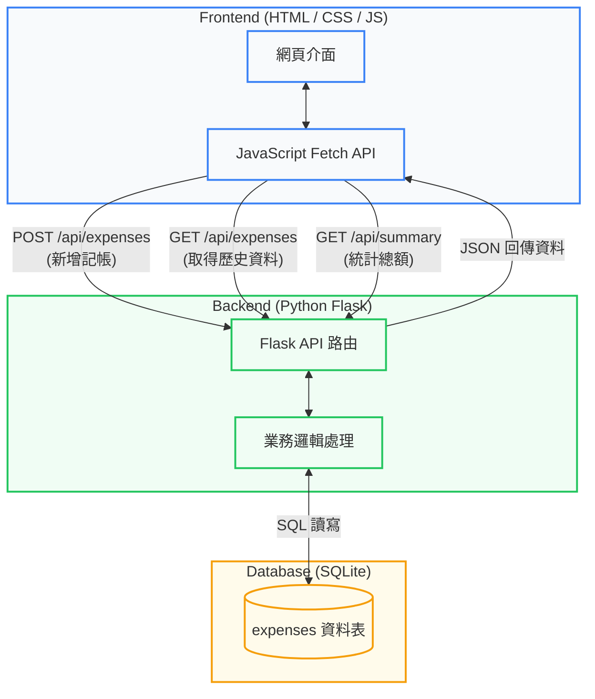

# 期末專題主題報告

**繳交時間：** 5/7
**對應 SDLC 階段：** 規劃（Planning）× 需求分析（Requirements Analysis）
**報告時間：** 5/7 上課時一組一組看

## 基本資訊
| 項目 | 內容 |
| :--- | :--- |
| **專題名稱** | 簡易個人記帳系統 (Simple Expense Tracker) |
| **組別 / 組號** | 第 ___ 組 |
| **組員姓名** | 1. _______ 2. _______ 3. _______ |

---

## 一、專題概述（Planning）

### 1.1 動機與背景
大學生常有生活費不知去向、月底吃土的困擾。市面上的記帳 App 功能往往過於複雜（如：各種廣告、複雜的圖表、投資理財功能），導致使用者難以養成每天記帳的習慣。因此，我們希望能開發一個「介面極度簡潔、只要幾秒鐘就能完成記帳」的輕量化網頁工具。

### 1.2 目標使用者
主要針對大學生，以及只需要簡單記錄日常開銷、不想要複雜功能的個人使用者。

### 1.3 專題目標
*   **目標一：** 提供直覺且快速的新增收支紀錄介面。
*   **目標二：** 能一目了然地查看近期的歷史收支明細。
*   **目標三：** 自動計算並顯示目前的總收入、總支出與結餘。

---

## 二、需求分析（Requirements Analysis）

### 2.1 功能性需求（Functional Requirements）
| 功能編號 | 功能名稱 | 功能描述 |
| :--- | :--- | :--- |
| **F-01** | 新增收支紀錄 | 使用者可輸入「金額」、「收/支類別」、「日期」與「備註」，並儲存至資料庫。 |
| **F-02** | 歷史紀錄列表 | 系統能列出所有的歷史記帳紀錄，並由新到舊依日期排序顯示在畫面上。 |
| **F-03** | 統計結餘總額 | 系統能自動計算所有紀錄，並在畫面上方顯示「總收入」、「總支出」與「目前結餘」。 |

### 2.2 非功能性需求（Non-functional Requirements）
| 類別 | 需求描述 |
| :--- | :--- |
| **效能** | 頁面載入時間與新增紀錄的反應時間需小於 2 秒，確保操作順暢。 |
| **安全性** | 避免基本的 SQL Injection 攻擊（透過 SQLAlchemy 或參數化查詢實作）。 |
| **易用性** | 前端介面需乾淨簡潔，且必須具備響應式設計（RWD），讓使用者用手機瀏覽器也能輕鬆記帳。 |

### 2.3 範圍限制（Out of Scope）
*   **本次不包含：** 使用者註冊與登入系統（初期僅實作單機/單一使用者版本，簡化開發）。
*   **本次不包含：** 複雜的資料視覺化圖表（如圓餅圖、長條圖分析）。
*   **本次不包含：** 匯出成 Excel 或 PDF 功能。

---

## 三、技術規劃（Technology Planning）

### 3.1 技術選型
| 層面 | 技術選擇 | 說明 |
| :--- | :--- | :--- |
| **前端** | HTML / CSS / JavaScript | 課堂統一規範，無使用前端框架。 |
| **後端** | Python + Flask | 課堂統一規範，作為 Web API 與伺服器。 |
| **資料庫** | SQLite | 輕量級關聯式資料庫，內建於 Python 中，無需額外安裝伺服器，非常適合簡單專案。 |
| **其他工具** | VS Code, Postman | 程式碼編輯器與 API 測試工具。 |

### 3.2 開發工具與協作方式
*   **版本控制：** GitHub
*   **溝通管道：** LINE 群組 / Discord 語音開會

### 3.3 系統架構圖
以下為本記帳系統之簡化系統架構與 API 傳遞流程，呈現前端、後端與資料庫之互動：



### 3.4 資料庫設計 (SQLite)
本系統主要使用單一資料表來儲存收支紀錄，設計如下：

**Table:** `expenses`

| 欄位名稱 (Field) | 資料型態 (Type) | 屬性 (Attributes) | 說明 (Description) |
| :--- | :--- | :--- | :--- |
| **id** | INTEGER | Primary Key, Auto Increment | 唯一識別碼 |
| **amount** | INTEGER | Not Null | 交易金額 |
| **type** | VARCHAR | Not Null | 收支類型 (income / expense) |
| **date** | DATE | Not Null | 發生日期 |
| **note** | TEXT | Nullable | 備註說明 |

---

## 四、專題時程規劃（Project Schedule）

### 階段一：規劃 Planning × Requirements × Design
| 日期 | 預計完成工作 | 產出物 | 負責 |
| :--- | :--- | :--- | :--- |
| 4/30 - 5/07 | 確定主題、整理需求、完成功能清單 | 主題報告投影片、本企劃書 | 全組 |
| 5/08 - 5/14 | 系統設計、畫面規劃與資料庫欄位設計 | 系統架構圖、AI 生成之預估畫面 | 全組 |

### 階段二：實作 Implementation × Testing
| 日期 | 預計完成工作 | 負責組員 |
| :--- | :--- | :--- |
| 5/15 - 5/21 | **功能 F-01**：前端輸入表單設計 + 後端新增資料 API | 組員 A |
| 5/22 - 5/28 | **功能 F-02**：前端列表呈現 + 後端讀取資料庫 API | 組員 B |
| 5/22 - 5/28 | **功能 F-03**：結餘計算邏輯與畫面整合 + 建立 SQLite 資料庫表單 | 組員 C |
| 5/29 - 6/04 | 功能整合、跨瀏覽器測試、Bug 修正 | 全組 |

### 階段三：期末展示 Demo
| 日期 | 預計完成工作 | 負責 |
| :--- | :--- | :--- |
| 6/05 - 6/11 | 系統部署（如可選）、期末報告投影片製作、Demo 腳本準備 | 全組 |

---

## 五、風險評估（Risk Assessment）

| 風險 | 發生可能性 | 影響程度 | 因應策略 |
| :--- | :--- | :--- | :--- |
| **對 Flask 框架不熟悉，開發卡關** | 高 | 高 | 提早一週開始研讀官方文件，並優先將最簡單的 API 寫出來測試。有問題立刻詢問老師。 |
| **前後端資料傳遞 (JSON) 格式不合** | 中 | 中 | 在進入「實作階段」前，全組先開會訂好前後端溝通的資料格式（API 文件）。 |
| **Git 合併程式碼時產生衝突 (Conflict)** | 中 | 中 | 每次推播 (Push) 前先拉取 (Pull) 最新進度，並將前後端檔案確實分開，減少同時改同一份檔案的機率。 |

---

## 六、組員分工

### 規劃階段（全組共同完成）
*   專題主題與目標確認
*   功能清單（需求分析）
*   系統架構與技術選型
*   畫面設計與 AI 預估畫面
*   週次時程與任務分配

### 實作階段（各組員負責獨立功能）

| 姓名 | 負責功能模組 | 對應功能編號 | 說明 |
| :--- | :--- | :--- | :--- |
| 姓名 A | 收支紀錄新增模組 | F-01 | 負責 HTML 表單刻版、JS 傳送資料，以及 Flask 中處理 `POST` 請求寫入資料庫。 |
| 姓名 B | 歷史紀錄顯示模組 | F-02 | 負責前端畫面列表設計、發送 `GET` 請求，以及 Flask 中從資料庫撈取全部資料的回傳邏輯。 |
| 姓名 C | 統計總額與資料庫建置 | F-03 | 負責 SQLite 資料庫的初始建構，計算總結餘邏輯，以及前端畫面上方統整區塊的 UI 更新。 |

> 註：功能分配可依實際組員人數（若為 2 人或 4 人）自行增減合併。

---

## 七、系統功能測試與 Bug 修正紀錄 (Testing & Debugging)

本專題在開發完成後進行了完整的前後端整合測試與響應式介面（RWD）調校。以下為功能測試報告、系統 Bug 紀錄以及相應的程式修正說明，可直接作為專案品質驗證與 SDLC 測試階段的依據。

### 7.1 系統功能測試表

| 測試編號 | 測試模組 / 功能 | 測試項目與步驟 | 預期結果 | 實際測試結果 | 判定 |
| :--- | :--- | :--- | :--- | :--- | :--- |
| **T-01** | F-01 新增記帳 | 輸入金額為 `500`、選擇「支出」、日期設為今天、備註填寫 `晚餐`，並點擊「新增紀錄」。 | 表單順利提交，彈出綠色 Toast 提示「新增成功」，輸入框自動清空並還原預設日期。 | 表單送出，綠色 Toast 提示成功，金額與日期正常重設。 | **通過** |
| **T-02** | F-02 歷史紀錄 | 新增數筆不同日期的記帳項目，觀察下方歷史明細列表的順序與內容。 | 列表正確顯示各筆金額與備註，日期顯示正常，且所有資料依日期由新到舊排序。 | 列表能正確載入，文字清晰無偏位，日期格式正常且完成由新到舊排序。 | **通過** |
| **T-03** | F-03 統計結餘 | 新增收入 `1000` 與支出 `300`，檢查儀表板的總收入、總支出與目前結餘。 | 總收入顯示 `+$1,000`，總支出顯示 `-$300`，結餘顯示 `$700`，格式附帶千分位與符號。 | 數值與正負號正確，千分位顯示正常，結餘數值自動扣減為 `$700`。 | **通過** |
| **T-04** | F-01 金額防禦測試 | 在金額欄位輸入 `-100` 或 `0` 或空白，嘗試送出表單。 | 前端阻擋提交，彈出紅色錯誤 Toast 提示「交易金額必須是高於 0 的有效數值！」 | 前端成功攔截，跳出紅色 Toast 警告，後端亦拒絕寫入資料庫。 | **通過** |
| **T-05** | F-02 列表空狀態 | 清空資料庫中的所有紀錄，重新載入記帳系統網頁。 | 歷史紀錄區塊顯示精美虛線框，並提示「目前沒有記帳資料」空狀態，不致顯得突兀。 | 歷史紀錄區塊呈現「目前沒有記帳資料」與收據圖標，無異常報錯。 | **通過** |
| **T-06** | F-02 長備註防溢出 | 輸入一筆備註字數極長（超過 30 個字）的記帳明細，觀察歷史清單版面。 | 歷史卡片中備註文字能自動折行，右側金額能完整對齊顯示，無被擠出卡片跑版狀況。 | 備註文字順利自動折行，右側金額依然整齊靠右對齊，完美防爆。 | **通過** |
| **T-07** | RWD 響應式排版 | 切換至平板尺寸（768px）與手機尺寸（375px），模擬行動裝置瀏覽。 | 平板版面寬度適中；手機版上方統計卡片改為垂直堆疊並改為列顯示，不重疊。 | 平板左右兩側無過多留白；手機版數據卡片改為單欄橫置，數據圖標與金額各歸其位。 | **通過** |

---

### 7.2 系統 Bug 紀錄表

| Bug 編號 | 發現模組 | 問題描述 (Bug Description) | 嚴重程度 | 修正狀態 |
| :--- | :--- | :--- | :--- | :--- |
| **B-01** | 歷史明細 (CSS) | 備註欄位輸入長字串或連續字元時，無法折行，導致右側金額溢出卡片跑版。 | **高** | 已修正 |
| **B-02** | 響應式佈局 (CSS) | 在平板（如寬度 768px）顯示時，主容器最大寬度限制在 550px，畫面顯得過於狹窄。 | **中** | 已修正 |
| **B-03** | 響應式佈局 (CSS) | 在手機版（如寬度 480px 以下）儀表板的三個統計卡片太窄，導致文字與圖標擠壓重疊。 | **高** | 已修正 |
| **B-04** | 資料防禦 (JS/API) | 金額欄位缺乏正數限制，能寫入 `0` 或 `負數`，導致統計數據錯誤。 | **高** | 已修正 |
| **B-05** | 後端服務 (Flask) | `app.py` 讀取靜態網頁使用相對路徑 `.`，若不是在同目錄啟動伺服器會引發 404 錯誤。 | **中** | 已修正 |

---

### 7.3 系統修正紀錄表

#### [B-01] 歷史紀錄長文字溢出問題修正
* **原因分析**：`.item-note` 沒有設定換行機制，且 Flex 子項目沒有設定收縮限制，導致長文字直接往右延伸，把金額推出卡片外。
* **修正對策**：
  在 [style.css](file:///c:/Users/ASUS-A15/Desktop/程式語言/ExpenseForm/style.css) 中，對 `.item-left` 與 `.item-details` 設定 `min-width: 0;` 以允許子元件收縮，並為 `.item-note` 添加 `word-break: break-all;` 與 `overflow-wrap: break-word;`。同時為金額 `.item-right` 設置 `flex-shrink: 0;` 確保其不會被壓縮。
  ```css
  .item-left {
      /* ... */
      min-width: 0; /* 允許折行 */
      flex: 1;
  }
  .item-note {
      /* ... */
      word-break: break-all; /* 強制長字串折行 */
      overflow-wrap: break-word;
  }
  .item-right {
      /* ... */
      flex-shrink: 0; /* 金額不壓縮 */
  }
  ```

#### [B-02] & [B-03] 平板與手機響應式佈局最佳化
* **原因分析**：
  1. 平板媒體查詢（960px）將主容器限制為 `550px`，寬度被浪費。
  2. 手機媒體查詢（480px）仍將統計卡片設為 `repeat(3, 1fr)` 窄三欄，金額字型過大引發重疊跑版。
* **修正對策**：
  在 [style.css](file:///c:/Users/ASUS-A15/Desktop/程式語言/ExpenseForm/style.css) 的媒體查詢中進行重構：
  1. 平板版最大寬度調整為 `750px`。
  2. 手機版將 `.summary-grid` 調整為 `grid-template-columns: 1fr;`（垂直堆疊），並將統計卡片變更為橫向列顯示 (`flex-direction: row; justify-content: space-between;`)，完美騰出空間展示金額。
  ```css
  @media (max-width: 960px) {
      .dashboard-container { max-width: 750px; } /* 寬度加寬 */
  }
  @media (max-width: 480px) {
      .summary-grid { grid-template-columns: 1fr; } /* 垂直堆疊 */
      .summary-card { flex-direction: row; justify-content: space-between; } /* 水平排版 */
  }
  ```

#### [B-04] 金額欄位缺乏防禦性驗證修正
* **原因分析**：前後端皆未校驗 `amount` 數值的邊界（<=0 或負數），造成不合常理的金額能夠被存入 SQLite 資料庫中。
* **修正對策**：
  1. **前端驗證**：在 [script.js](file:///c:/Users/ASUS-A15/Desktop/程式語言/ExpenseForm/script.js) 表單 submit 事件中，加入對金額的正數判斷。無效時使用紅底的 `showToast` 顯示錯誤並不予發送請求。
     ```javascript
     const amount = parseFloat(amountVal);
     if (isNaN(amount) || amount <= 0) {
         showToast('<i class="fas fa-exclamation-circle"></i> 交易金額必須是高於 0 的有效數值！', 'error');
         return;
     }
     ```
  2. **後端驗證**：在 [app.py](file:///c:/Users/ASUS-A15/Desktop/程式語言/ExpenseForm/app.py) 中，對傳入的 JSON `amount` 嘗試轉換為 `float`，並檢驗是否大於 0。若不大於 0，回傳 HTTP 400 錯誤。
     ```python
     try:
         amount_val = float(amount)
         if amount_val <= 0:
             return jsonify({"status": "error", "message": "交易金額必須大於零"}), 400
     except (ValueError, TypeError):
         return jsonify({"status": "error", "message": "交易金額格式錯誤"}), 400
     ```

#### [B-05] Flask 啟動路徑之 404 問題修正
* **原因分析**：原本 `app.py` 在 `send_from_directory` 中使用相對路徑 `'.'` 讀取網頁。若工作目錄（Cwd）不在 `ExpenseForm` 下，Flask 將在其執行命令的目錄尋找 `index.html`，進而引發 404 找不到檔案錯誤。
* **修正對策**：
  在 [app.py](file:///c:/Users/ASUS-A15/Desktop/程式語言/ExpenseForm/app.py) 中，以 `__file__` 取得當前檔案所在的絕對路徑目錄 `BASE_DIR`，並以其作為資料庫與靜態檔案託管路徑。
  ```python
  BASE_DIR = os.path.dirname(os.path.abspath(__file__))
  DB_FILE = os.path.join(BASE_DIR, 'expenses.db')
  # 靜態路由
  return send_from_directory(BASE_DIR, 'index.html')
  ```

